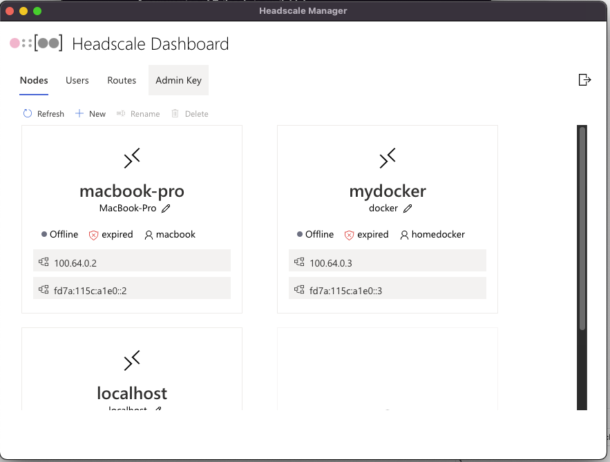
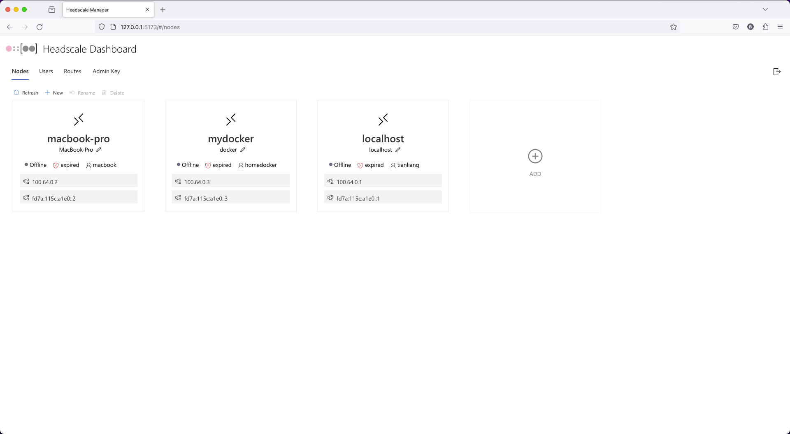
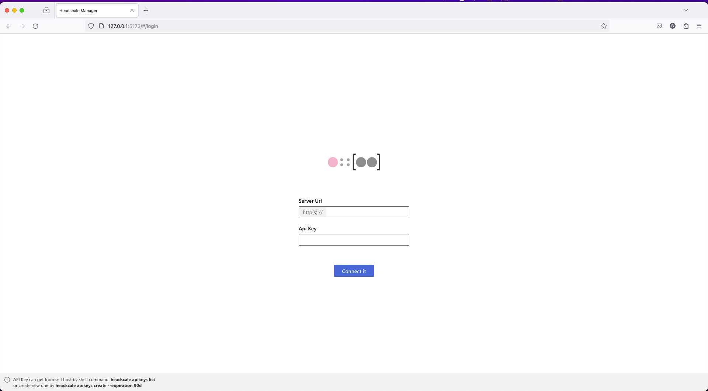

# Headscale Dashboard

# technology stack

- [node](https://nodejs.org/)
- [yarn](https://yarnpkg.com/)
- [electron](https://www.electronjs.org/)
- [react](https://reactjs.org/)
- [swr](https://swr.vercel.app/)
- [tailwindcss](https://tailwindcss.com/)
- [vite](https://vitejs.dev/)
- [typescript](https://www.typescriptlang.org/)
- [styled-components](https://styled-components.com/)
- [Fluent](https://react.fluentui.dev/)

# road map

#### 0.0.0-alpha.0

- initial
- api server
- simple web ui
- web version
- electron version

#### 0.0.0-alpha.1

- bugfix
- dynamic loading response in ui
- serve error response handle
- serve version (go + sqlite)
- ui redesign
- dark mode
- i18n
- ci/cd
- open source

#### 0.0.0-alpha.2

- bugfix
- jest?
- css dynamic
- docker
- flutter or react native to support mobile

more...